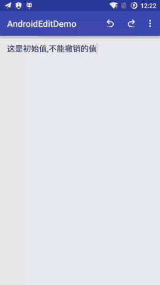

# AndroidEdit
> 提取我正在做[Markdown编辑器](https://github.com/qinci/MarkdownEditors)的一个功能

####EditText的撤销和恢复撤销操作
#####使用
* 引入库
	* compile 'ren.qinc.edit:lib:0.0.4'
* 初始化

```java
    mEditText = ((EditText) findViewById(R.id.editText));
    //创建PerformEdit，一定要传入不为空的EditText
    mPerformEdit = new PerformEdit(mEditText);
    mPerformEdit.setDefaultText("这是初始值,不做撤销记录");
```

* 撤销和恢复

```java
	//撤销
	mPerformEdit.undo();
    //重做
    mPerformEdit.redo();
    //清除历史
    mPerformEdit.clearHistory();
```

* 演示图

	

* 最后欢迎您star、fork
